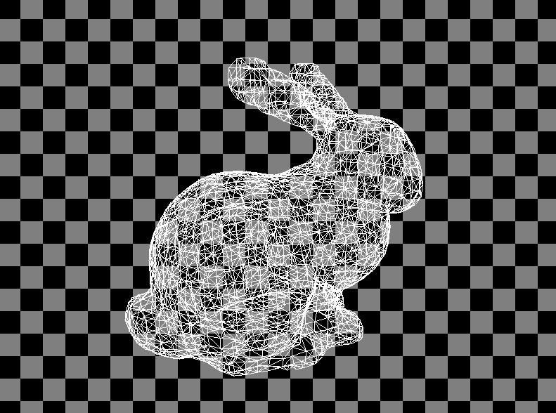

# My simple soft renderer

A simple soft renderer build from scratch.

You can drag to rotate and use wasd to move.

During creation of this soft renderer, I created a kind of model format called "simple" for convenience. 

Like the name, the modle format is also really simple, which consists of these parts: 

| Meaning                          | format     |
| -------------------------------- | ---------- |
| num_vertices num_faces(triangle) | %d %d\n    |
| vertex[0]                        | %f %f %f\n |
| vertex[1]                        | %f %f %f\n |
| ...                              | ...        |
| vertex[num_vertices - 1]         | %f %f %f\n |
| face[0]                          | %d %d %d\n |
| face[1]                          | %d %d %d\n |
| ...                              | ...        |
| face[num_faces - 1]              | %d %d %d\n |

First use ply2simple.c convert official staford bunny model(in ply format) to simple format, then use my custom soft renderer to load and render it, finally the picture is created.
